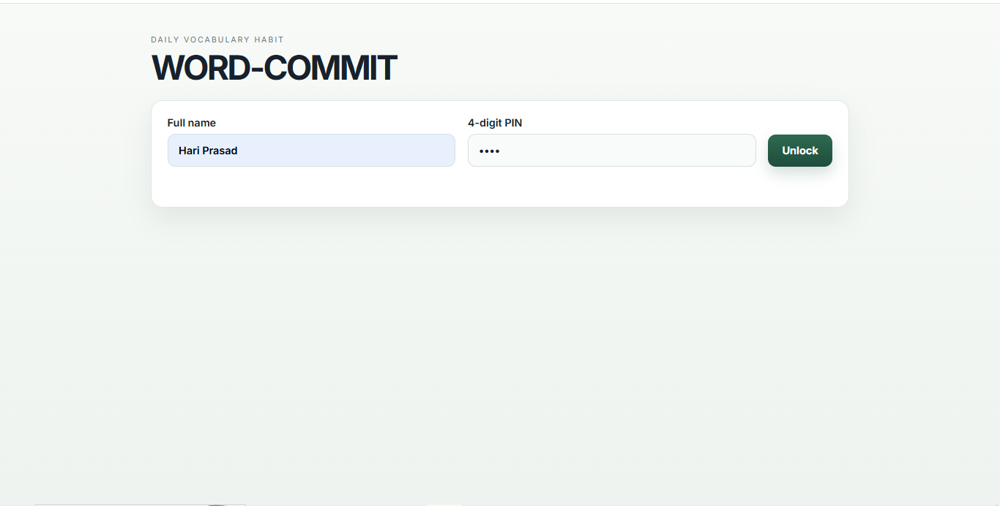
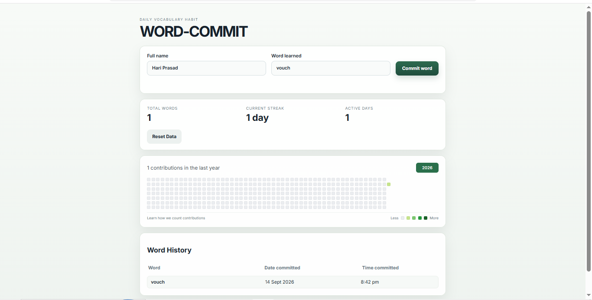
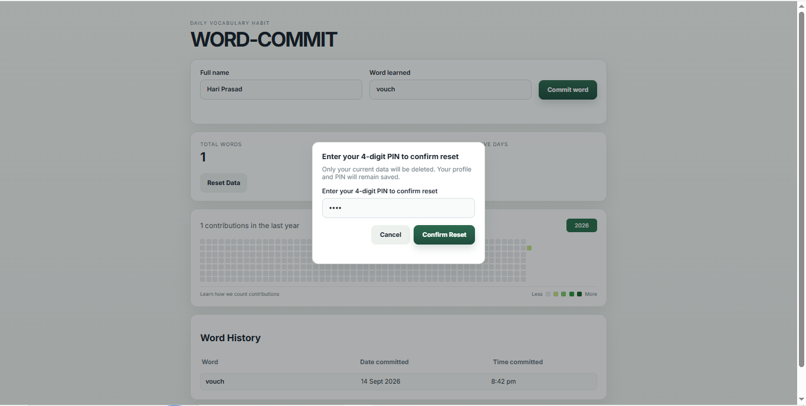

# WORD-COMMIT

A daily vocabulary tracker inspired by GitHub contribution heatmaps.

## Features

- Unlock with a full name and 4-digit PIN
- Commit one word per day
- Track total words, streaks, and active days
- View a GitHub-style contribution calendar
- Browse recent word history
- Reset personal data with PIN confirmation

## Tech Stack

- Node.js
- Express
- Vanilla JavaScript
- Local JSON file storage

## Project Structure

```text
word-commit/
├── data/
│   ├── entries.example.json
│   └── entries.json   # ignored in git, created locally
├── public/
│   ├── app.js
│   ├── index.html
│   └── styles.css
├── src/
│   ├── config/
│   │   └── constants.js
│   ├── data/
│   │   └── store.js
│   ├── services/
│   │   └── heatmap.js
│   ├── utils/
│   │   └── validation.js
│   └── server.js
├── .gitignore
├── package-lock.json
├── package.json
└── README.md
```

## Installation

```bash
npm install
```

## Run locally

```bash
npm start
```

Then open:

```text
http://localhost:3000
```

## Screenshots

<p align="center">
  
  
  
</p>

## Notes

- The app stores local data in `data/entries.json`.
- `data/entries.json` is intentionally ignored in Git so personal data is not pushed to GitHub.
